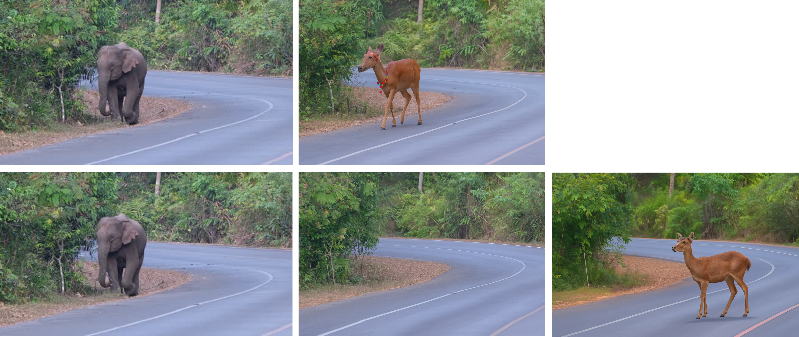
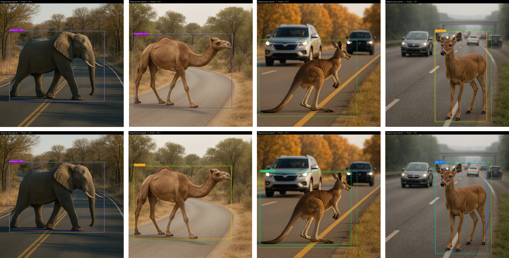
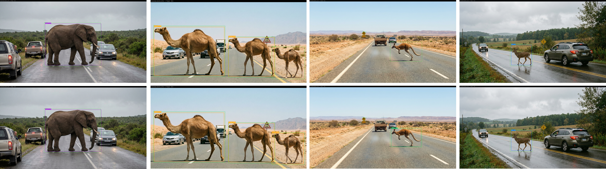
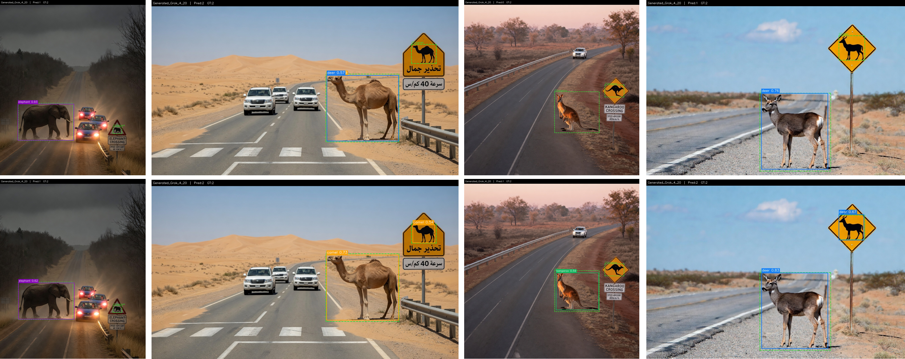

[](https://github.com/ai4smlab/Rare-Event-Data-Augmentation/blob/main/LICENSE)


<div align="center">

## Agentic Ontology-guided Image Generation and Evaluation for Rare-Event Data Augmentation in Safety-Critical Perception

<br>

</div>


## 🧭 Overview

The work addresses the challenge of **rare-event data scarcity in safety-critical perception systems**, where dangerous but infrequent events are difficult to collect at scale because of:

- Low-frequency occurrence
- Adverse environmental conditions
- Ethical and logistical constraints
- Geographic and contextual sparsity

The framework is demonstrated through a **wildlife–traffic interaction case study**, focusing on scenarios such as:

- Large animals crossing highways
- Low-visibility nighttime encounters
- Foggy or rainy road conditions
- Rural and high-speed roadway interactions
- Safety-critical collision-risk scenes

The proposed framework integrates:

- **Semantic ontology-guided instructions**
- **Autonomous image generation agents**
- **LMM-based evaluation agents**
- **Closed-loop refinement and regeneration**
- **Objective no-reference image quality assessment**
- **Task-aware downstream detectability evaluation**

The framework supports both:

- **Reference-based image generation**
- **Referenceless ontology-guided generation**

and enables controlled comparison across foundation models including:

- OpenAI
- Gemini
- Grok

---

# 📌 Highlights

- Agentic ontology-guided framework for rare-event synthetic image generation and evaluation
- Comparative evaluation of reference-based and referenceless generation under shared ontology constraints
- Closed-loop refinement and recommendation-driven regeneration using LMM feedback
- Multi-layer evaluation using objective metrics, LMM evaluators, human evaluation, and zero-shot detection
- Cross-foundation-model comparison across OpenAI, Gemini, and Grok
- Demonstration that perceptual realism does not always imply downstream detectability performance

---

# 🧠 Agentic AI-based Framework


**Figure:** Agentic ontology-guided framework for comparative synthetic image generation, evaluation, and regeneration for rare-event data augmentation.

The framework consists of four major components:

1. **Semantic Ontology-based Instructions**
2. **Image Generation Agents**
3. **Evaluation Agents**
4. **Image Refinement and Regeneration Agents**

The framework operates as a **closed-loop multi-agent system**:

- Ontology instances define semantic constraints
- Generation agents synthesize images
- Evaluation agents assess realism and consistency
- Feedback is converted into actionable recommendations
- Images are refined or regenerated when quality thresholds are not satisfied

---

# 🧩 Semantic Ontology


**Figure:** Class diagram of the semantic ontology for wildlife–traffic image generation.

The ontology acts as a semantic control layer for image generation.

The central entity is:

- `Scene`

which aggregates:

- `EnvironmentContext`
- `RoadInfrastructure`
- `WildlifeActor`
- `TrafficAgent`
- `SignageControl`
- `EventSemantics`
- `CameraRenderContext`

The ontology supports explicit representation of:

- Weather and lighting
- Animal behavior and positioning
- Vehicle interactions
- Road geometry and infrastructure
- Signage and warnings
- Risk levels and interaction semantics
- Camera viewpoint and rendering parameters

This structure enables:

- Reproducible generation
- Controlled scene synthesis
- Cross-model comparison
- Semantic consistency validation

## 📄 Ontology Resources

- [`Ontolog.owl`](codes/Ontolog.owl) — OWL ontology specification
- [`Ontolog_PlantUML.txt`](codes/Ontolog_PlantUML.txt) — PlantUML source file
- **Rendered PlantUML Diagram:**  
  [View Online](https://www.plantuml.com/plantuml/uml/RLN1ZkCs3BtxAuIvx6w1MMmlFVIqWsaFSogmAT2ZmSYCJ4IYN8hoh5lqtsihavqeyYdEUxJu7aNINvE2Q0w-KrAFvY_oWwSJccU9AH4xynB0eVc3DVhe5lDedZsaP7uZS0AXwpwOWov-Y_mO9wN8uCqngndHJya4K3iQ7T7u6C-VkdGcda0W6BiTywGgj4RZYurye7_GVBa9IICCyNKx-WG-uGqZCVDWep2A-QNhR95qiCXe_ksCITjJJuFvTHKdnEu7fik4jwYY210tkA2Zo7r0XG4Ktgd_hjb-vvaaSa3MvyYAtxMaFe8zkoAlHvuh0GWfSfMS0jeuOANp5K57bDv67aYfViEJ6tLzt6TdIdGaJxhq0kpkZ8O91JGBzYT4VykzwRLnHdd7twr-Yp2yy4aWgMIx7L6ioWetXVF0k9wKMLVqXHKToZKsWA8GLBaBSS8YB3M4pJ8NwfO98EVrAVMJO4BMgiXPYfcjHbHBRg_msknFLgCKIy0KmFTfGakLd2lpTmPMqgKo1mvx2-k_A4jLL-G1PPUo4RIVG1M5Tz9CCLMtMrF5JiiSSOIPejnIn8e2TZkhJmgwLuO_1KudiayE-TB3CuvaVJii5xovtehnKVPU6KYmgDWdamBRAbUQ48SYkO97XA4CmGwL0_1RJzWzdmTo30wtQPNeYzEqGetD0dfWby6rH5h2CVe6thknGknEAkJlv0bawRUOlUqo8-i10x2IJKKhRb2xg2YTUxzobQHXOGXaKribOaM-h6dIgYLZLXl3Nk6U8Q30jzBDjxlE5hoV2L-dIDKWNZbWvwlyfsZ1huBPwNY7vzGFEDLmYALrZpxNRHt0uJgCZGd157rMYdLHFvYdbA8bs9XaW0SJibUQF5bImcG-GZB4vKirN3vjdxhB1-NXvmVp-5X-sftVnhJByZxcy-UV7khTSnVnPOkenh9DKpTpozSDrF8xTzfzNV_buFy7)

---

# 🖼 Reference-based Image Generation

The framework supports two reference-based image editing strategies.

## 1️⃣ Single-stage Replacement

The original animal is directly replaced in a single operation while preserving the surrounding scene.

### Prompt Template

```text
Replace only the {REF_ANIMAL} inside the mask with {TARGET_ANIMAL}.
Preserve every unmasked pixel exactly.
Match pose, scale, perspective, and shadow direction.
```

## 2️⃣ Two-stage Remove-and-Insert

The process is decomposed into:

1. Removal of the original animal
2. Insertion of the target animal

This improves:

- Boundary quality
- Geometric consistency
- Object integration
- Background preservation



**Figure:** Comparison between single-stage (Upper) and two-stage (Lower) reference-based generation.

---

# 🌌 Referenceless Ontology-guided Image Generation

The referenceless mode generates complete wildlife–traffic scenes directly from ontology-guided prompts without relying on source imagery.

Advantages include:

- No dependency on copyrighted source images
- Large-scale rare-event generation
- Strong semantic controllability
- High diversity of environmental conditions
- Cross-model reproducibility

The same ontology instances are used across:

- OpenAI
- Gemini
- Grok

allowing fair comparative evaluation.

## Example Prompt Structure

```text
Generate a high-resolution, photorealistic image of two adult elk
crossing a rural two-lane forest highway at dusk under overcast
conditions. Include wet asphalt, roadside guardrails, a white SUV
braking at a moderate distance, and an animal crossing sign.
```

---

# 🧪 Synthetic Image Generation Examples


**Figure:** Qualitative comparison of referenceless ontology-guided synthetic image generation. (a) OpenAI initial synthesis using GPT-5, (b) OpenAI direct refinement using gpt-image-1, (c) OpenAI recommendation-driven regeneration using gpt-image-1, (d) Grok 4.20, and (e) Gemini 3~Pro Image..

## 📂 Image Collections

### Naturalistic Reference Images
- [`Naturalistic reference`](images/Naturalistic_reference/)

### OpenAI-based Generation
- [`Generated images using OpenAI models`](images/Generated_OpenAI/)
- [`Refined images using OpenAI models`](images/Refined_OpenAI/)
- [`Regenerated images using OpenAI models`](images/Regenerated_OpenAI/)

### Gemini-based Generation
- [`Generated images using Gemini 3 Pro`](images/Generated_Gemini_3_Pro/)

### Grok-based Generation
- [`Generated images using Grok 4.20`](images/Generated_Grok_4_20/)

---

# 📊 Objective No-reference Image Quality Assessment (IQA)

The framework evaluates synthetic images using objective no-reference metrics:

| Metric | Interpretation |
|---|---|
| **BRISQUE** | Structural naturalness |
| **ILNIQE** | Local natural image quality |
| **PIQE** | Perceptual distortion |
| **NRQM** | Information content and perceptual quality |

Lower values are better for:

- BRISQUE
- ILNIQE
- PIQE

Higher values are better for:

- NRQM

## Sample IQA Results

| Method | BRISQUE ↓ | ILNIQE ↓ | PIQE ↓ | NRQM ↑ |
|---|---|---|---|---|
| Referenceless OpenAI (Regenerated) | 19.47 | 48.76 | 34.10 | 7.39 |
| Referenceless Gemini 3 Pro | **9.67** | **41.31** | **32.12** | **8.36** |
|Referenceless  Grok 4.20 | 11.55 | 42.99 | 34.48 | 8.13|

## Observation

Gemini 3 Pro achieves the strongest perceptual realism according to objective no-reference quality metrics.

---

# 🧑‍⚖️ Subjective Evaluation

Subjective evaluation combines:

- **LMM-as-a-Judge**
- **Panel of LMM Evaluators (PoLL)**
- **Human Evaluation**

The framework uses GPT-5 as the primary evaluation agent and additionally incorporates a heterogeneous evaluation panel including:

- gpt-4o
- gpt-4o-mini
- gpt-4-turbo
- o3
- gpt-5

## Evaluation Criteria

Images are evaluated based on:

- Visual realism
- Semantic consistency
- Wildlife plausibility
- Road-scene coherence
- Lighting and shadows
- Texture quality
- Artifact severity
- Safety-critical interaction plausibility

## Sample Subjective Results

| Method | LMM-as-a-Judge ↑ | Panel of LMMs ↑ | Human Evaluation ↑ |
|---|---|---|---|
| OpenAI (Regenerated) | 4.38 | 3.90 | 2.45 |
| Gemini 3 Pro (Referenceless) | **4.74** | **5.00** | **3.54** |
| Grok 4.20    | 3.60 |  4.00 |  2.31 | 

## Observation

Gemini 3 Pro consistently achieves the highest perceptual realism across machine-based and human evaluation.

---

# 🔄 Closed-loop Refinement and Regeneration

When generated images fail to satisfy the predefined quality threshold:

1. Evaluation agents generate recommendations
2. Feedback is transformed into actionable instructions
3. Images are either refined or regenerated
4. Re-evaluation is performed automatically

## Example LMM Feedback

```text
Add stronger, consistent shadows for lampposts, signs, and animals;
introduce micro-textures and tire marks on the road; refine realistic
lane markings; improve atmospheric haze and object contact details.
```

## Refinement Prompt

```text
Refine the realism of this image based on the following feedback:
{recommendation}
```

## Regeneration Prompt

```text
Regenerate the image realistically while preserving the main composition,
structure, and semantic intent.
```

---

# 🔎 Downstream Object Detectability Analysis

Perceptual realism alone does not guarantee downstream perception performance.

To evaluate task-level utility, the generated images are analyzed using:

- **YOLO-World**
- **GDINO (Grounding DINO)**

The analysis focuses on large wildlife classes including:

- Camel
- Elephant
- Deer
- Kangaroo

Bounding-box annotations were prepared using:

- **Label Studio**

---

# 📊 Detection Metrics

| Metric | Description |
|---|---|
| Precision | TP / (TP + FP) |
| Recall | TP / (TP + FN) |
| F1-score | Harmonic mean of Precision and Recall |
| FNR | False Negative Rate |
| FAR | False Alarm Rate |
| mAP@0.50 | Mean Average Precision |
| mAP@0.50:0.95 | COCO-standard mAP |
| Mean IoU | Localization overlap quality |

---

# 📈 Sample Detection Results

| Object Detector | Model | Precision | Recall | F1 | FNR | mAP@0.50 | mAP@0.50:0.95 | Mean IoU |
|---|---|---|---|---|---|---|---|---|
| YOLO-World | OpenAI Models | 0.80 | **0.63** | **0.90** | 0.37 | **0.57** | **0.46** | **0.93** |
| YOLO-World | Gemini 3 Pro | **0.90** | 0.41 | 0.75 | **0.59** | 0.50 | 0.28 | 0.88 |
| YOLO-World | Grok 4.20 | 0.84 | 0.52 | 0.81 | 0.48 | 0.54 | 0.39 | 0.90 |
| GDINO | OpenAI Models | **0.98** | **1.00** | **0.98** | **0.00** | **0.97** | **0.76** | **0.93** |
| GDINO | Gemini 3 Pro | 0.92 | 0.89 | 0.93 | 0.11 | 0.73 | 0.58 | 0.88 |
| GDINO | Grok 4.20 | 0.95 | 0.91 | 0.94 | 0.09 | 0.81 | 0.63 | 0.90 |

## Key Observation

Higher perceptual realism does not always translate into stronger downstream detectability.

- Gemini often produces visually superior images according to perceptual metrics.
- OpenAI-generated images achieve the strongest recall and mAP performance, particularly under GDINO.
- Grok demonstrates intermediate performance between OpenAI and Gemini across most detection metrics.
- GDINO consistently outperforms YOLO-World across all generation models.
- The results highlight the importance of combining perceptual evaluation with task-aware downstream validation in safety-critical perception systems.

---

# 🖼 Detection Examples



**Figure:** Zero-shot detection results for OpenAI-generated synthetic images.



**Figure:** Zero-shot detection results for Gemini-generated synthetic images.



**Figure:** Zero-shot detection results for Grok-generated synthetic images.

---

# ❓ Research Questions

The paper investigates the following research questions:

### RQ1
How do reference-based and referenceless ontology-guided generation methods compare using objective and subjective metrics?

### RQ2
To what extent do refinement and recommendation-driven regeneration improve image quality?

### RQ3
How do OpenAI, Gemini, and Grok compare under identical ontology-guided prompts?

### RQ4
Does higher perceptual realism translate into stronger downstream object detectability?

---

# 🎯 Main Contributions

- Agentic ontology-guided framework for rare-event synthetic image generation
- Semantic control using a formal ontology
- Closed-loop multi-agent evaluation and refinement
- Comparative analysis of reference-based and referenceless generation
- Cross-model evaluation across OpenAI, Gemini, and Grok
- Multi-layer evaluation architecture combining objective, subjective, and downstream metrics
- Zero-shot detectability analysis for safety-critical perception
- Wildlife–traffic case study demonstrating rare-event augmentation capabilities

---

# 🚗 Applications

- Autonomous driving perception
- Wildlife–vehicle collision prevention
- ADAS benchmarking
- AV safety evaluation
- Rare-event dataset generation
- Transportation safety research
- Intelligent transportation systems
- Safety-critical computer vision

---

# 📁 Repository Structure

```text
.
├── codes/
│   ├── Ontolog.owl
│   └── Ontolog_PlantUML.txt
├── images/
│   ├── Workflow.png
│   ├── Ontolog.svg
│   ├── Synthetic_images.png
│   ├── OpenAI.png
│   ├── Gemini.png
│   ├── Naturalistic_reference/
│   ├── Generated_OpenAI/
│   ├── Refined_OpenAI/
│   ├── Regenerated_OpenAI/
│   ├── Generated_Gemini_3_Pro/
│   └── Generated_Grok_4_20/
└── README.md
```

---

# 🔖 Citation

If you use this repository, please cite:

**Text Citation**

Khamis, A. (2026). *Agentic Ontology-guided Image Generation and Evaluation for Rare-Event Data Augmentation in Safety-Critical Perception*. *Array*. https://doi.org/10.1016/j.array.2026.100932

**BibTeX**

```bibtex
@article{khamis2026agentic,
  title   = {Agentic Ontology-guided Image Generation and Evaluation for Rare-Event Data Augmentation in Safety-Critical Perception},
  author  = {Khamis, Alaa},
  journal = {Array},
  year    = {2026},
  doi     = {10.1016/j.array.2026.100932}
}
```

---

# 🏁 Acknowledgment

The author gratefully acknowledges Dr. Yun-Qian Miao for insightful discussions and collaboration in image generation research. The author also acknowledges the support of the Deanship of Research at King Fahd University of Petroleum and Minerals (KFUPM) through Grant ECR241-ISE-301, “Agentic AI-based Framework for Seamless Integrated Mobility,” which supported this work.

---

