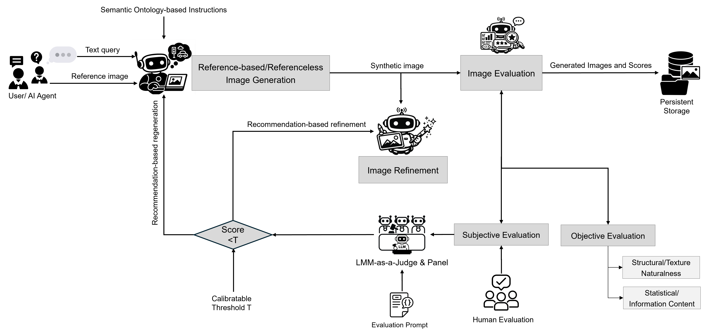
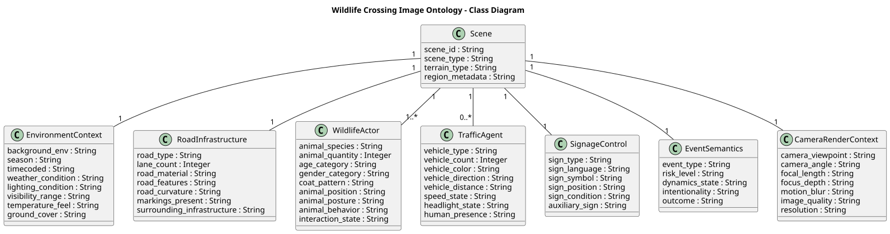

[](https://github.com/ai4smlab/Rare-Event-Data-Augmentation/blob/main/LICENSE)


<div align="center">

## Agentic Ontology-guided Synthetic Image Generation for Rare-Event Data Augmentation: Wildlife–Traffic as a Case Study

**Alaa Khamis**  

</div>

---

## 🧭 Overview

This repository accompanies the paper:

> **Agentic Ontology-guided Synthetic Image Generation for Rare-Event Data Augmentation: Wildlife–Traffic as a Case Study**, submitted to **IEEE Access**.

The work addresses the challenge of **data scarcity in rare and safety-critical visual scenarios**, with a particular focus on **wildlife–traffic interactions**. Such events are highly stochastic, difficult to capture at scale, and often occur under adverse conditions (e.g., nighttime, fog, rural highways).

To address these limitations, the paper proposes an **agentic AI-based framework** that integrates:

- Semantic **ontology-guided instructions**
- Autonomous **image generation agents**
- **Closed-loop evaluation and refinement**
- **Large multimodal models (LMMs)** as judges
- Objective **no-reference image quality metrics**

The result is a **controllable, scalable, and self-improving synthetic data augmentation framework** that supports both reference-based and **referenceless image generation**.

---

## 🧠 Agentic AI Framework



**Figure:** An agentic AI framework for ontology-guided synthetic image generation and evaluation.

---

## 🧩 Semantic Ontology



**Figure:** Class diagram of the semantic ontology for wildlife–traffic image generation with examples.

📄 **OWL Specification:**  
- [`Ontolog.owl`](codes/Ontolog.owl) — machine-readable OWL file of the proposed semantic ontology.  
- [`Ontolog_PlantUML.txt`](code/Ontolog_PlantUML.txt) — PlantUML source file used to generate the ontology class diagram.  
- **Rendered PlantUML diagram:**  [View online](https://www.plantuml.com/plantuml/uml/RLN1ZkCs3BtxAuIvx6w1MMmlFVIqWsaFSogmAT2ZmSYCJ4IYN8hoh5lqtsihavqeyYdEUxJu7aNINvE2Q0w-KrAFvY_oWwSJccU9AH4xynB0eVc3DVhe5lDedZsaP7uZS0AXwpwOWov-Y_mO9wN8uCqngndHJya4K3iQ7T7u6C-VkdGcda0W6BiTywGgj4RZYurye7_GVBa9IICCyNKx-WG-uGqZCVDWep2A-QNhR95qiCXe_ksCITjJJuFvTHKdnEu7fik4jwYY210tkA2Zo7r0XG4Ktgd_hjb-vvaaSa3MvyYAtxMaFe8zkoAlHvuh0GWfSfMS0jeuOANp5K57bDv67aYfViEJ6tLzt6TdIdGaJxhq0kpkZ8O91JGBzYT4VykzwRLnHdd7twr-Yp2yy4aWgMIx7L6ioWetXVF0k9wKMLVqXHKToZKsWA8GLBaBSS8YB3M4pJ8NwfO98EVrAVMJO4BMgiXPYfcjHbHBRg_msknFLgCKIy0KmFTfGakLd2lpTmPMqgKo1mvx2-k_A4jLL-G1PPUo4RIVG1M5Tz9CCLMtMrF5JiiSSOIPejnIn8e2TZkhJmgwLuO_1KudiayE-TB3CuvaVJii5xovtehnKVPU6KYmgDWdamBRAbUQ48SYkO97XA4CmGwL0_1RJzWzdmTo30wtQPNeYzEqGetD0dfWby6rH5h2CVe6thknGknEAkJlv0bawRUOlUqo8-i10x2IJKKhRb2xg2YTUxzobQHXOGXaKribOaM-h6dIgYLZLXl3Nk6U8Q30jzBDjxlE5hoV2L-dIDKWNZbWvwlyfsZ1huBPwNY7vzGFEDLmYALrZpxNRHt0uJgCZGd157rMYdLHFvYdbA8bs9XaW0SJibUQF5bImcG-GZB4vKirN3vjdxhB1-NXvmVp-5X-sftVnhJByZxcy-UV7khTSnVnPOkenh9DKpTpozSDrF8xTzfzNV_buFy7)


## 🧪 Synthetic Image Generation Examples


**Figure:** Examples of generated images using a referenceless ontology-guided approach. (1) GPT-5 synthesis, (b): gpt-image-1 refinement, (c) Recommendation-driven regeneration, (d) Gemini 3 Pro synthesis.


📂 **Image Sets (by generation stage and model):**
- [`Naturalistic reference`](images/Naturalistic_reference/)
- [`Generated images using OpenAI models`](images/Generated_OpenAI/)
- [`Refined images using OpenAI models`](images/Refined_OpenAI/)
- [`Regenerated images using OpenAI models`](images/Regenerated_OpenAI/)
- [`Generated images using Nano Banana Pro (Gemini 3 Pro)`](images/Generated_Gemini_3_Pro/)

---

## 📊 Sample Objective Results (no-reference image quality assessment (IQA))

The following table summarizes representative **no-reference image quality assessment (IQA)** results reported in the paper, comparing different image generation strategies. Lower values are better for **BRISQUE**, **ILNIQE**, and **PIQE**, while higher values are better for **NRQM**.

| Method                               | BRISQUE ↓ | ILNIQE ↓ | PIQE ↓ | NRQM ↑ |
|--------------------------------------|-----------|----------|--------|--------|
| Naturalistic Reference               | 12.62     | 42.20    | 28.76  | 8.09   |
| Referenceless OpenAI (Generated)     | 19.90     | 47.50    | 39.76  | 7.57   |
| Referenceless OpenAI (Recommendation-driven Refined)     | 20.77     | 48.03    | 35.90  | 7.13   |
| Referenceless OpenAI (Recommendation-driven Regen) | 19.47     | 48.76    | 34.10  | 7.39   |
| Referenceless Gemini 3 Pro         | **9.67**  | **41.31**| **32.12** | **8.36** |

**Observation:**  Referenceless ontology-guided generation using **Gemini 3 Pro** consistently achieves the best structural naturalness and perceptual information content, outperforming both reference-based pipelines and regenerated OpenAI outputs.

---

## 🧑‍⚖️ Sample Subjective Evaluation Results (LMM-based & Human)

The following table reports representative **subjective evaluation scores** comparing images generated using **OpenAI models** and **Nano Banana Pro (Gemini 3 Pro)** under the same referenceless ontology-guided framework.  
Scores are reported on a **5-point Likert scale**, where higher values indicate better perceived realism and semantic consistency.

| Method                         | LMM-as-a-Judge ↑ | Panel of LMMs ↑ | Human Evaluation ↑ |
|--------------------------------|------------------|------------------|--------------------|
| OpenAI (Regenerated)           | 4.38             | 3.90             | 2.45               |
| Gemini 3 Pro (Referenceless)   | **4.74**         | **5.00**         | **3.54**           |

**Observation:**  Gemini 3 Pro consistently outperforms OpenAI-based generation across all subjective evaluation modalities. Notably, Gemini achieves near-perfect agreement among LMM judges and substantially higher human realism scores, indicating stronger alignment with human perceptual expectations.

---

## 📊 Sample Results & Brief Observations

- Referenceless ontology-guided generation outperforms reference-based pipelines in perceptual realism.
- Recommendation-driven regeneration is more effective than direct refinement.
- Gemini 3 Pro achieves near-parity with natural images in subjective realism.

---

## 🎯 Key Contributions

- Agentic AI framework for rare-event data augmentation  
- Ontology-guided semantic control for image synthesis  
- Referenceless generation with clear data lineage  
- Closed-loop evaluation and self-improvement  
- Robust performance across foundation models  

---

## 🚗 Use Cases

- Autonomous driving perception  
- Wildlife–vehicle collision prevention  
- ADAS and AV safety benchmarking  
- Synthetic dataset generation for rare events  
- Intelligent transportation systems research  

---

## 🔖 Citation

If you use this repository, please cite:

Khamis, A., “Agentic Ontology-guided Synthetic Image Generation for Rare-Event Data Augmentation: Wildlife–Traffic as a Case Study,” *submitted to IEEE Access*, 2025.

```bibtex
@article{khamis2025rare,
  title   = {Agentic Ontology-guided Synthetic Image Generation for Rare-Event Data Augmentation: Wildlife--Traffic as a Case Study},
  author  = {Khamis, Alaa},
  journal = {Submitted to IEEE Access},
  year    = {2025}
}

```

## 🏁 Acknowledgment

The author gratefully acknowledges **Dr. Yun-Qian Miao** for insightful discussions and collaboration in the field of image generation.This work was supported by the **Deanship of Research at King Fahd University of Petroleum and Minerals (KFUPM)** under **Grant ECR241-ISE-301**, titled: “Agentic AI-based Framework for Seamless Integrated Mobility.”
---